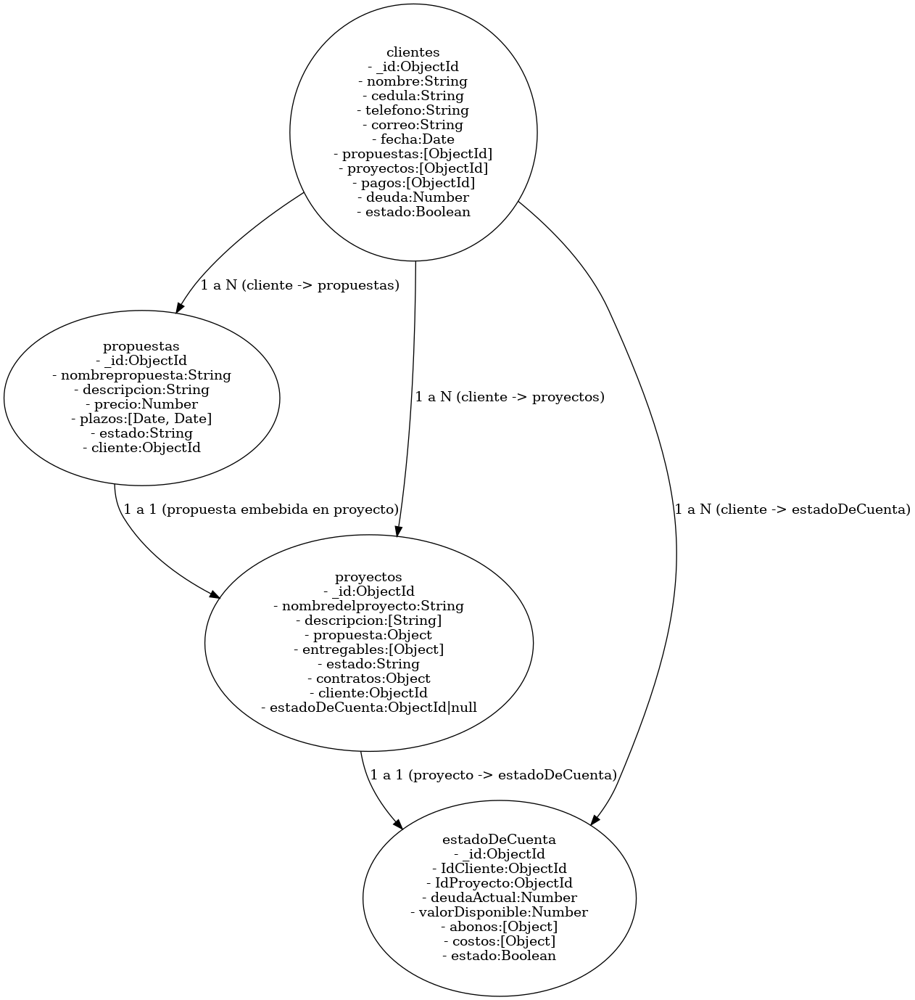

# 📁 DB

Esta carpeta contiene los módulos encargados de gestionar la conexión, mantenimiento y carga de datos de la base de datos MongoDB utilizada por el sistema. Incluye funciones para crear esquemas, hacer limpieza total, cargar datos de prueba y verificar el estado actual de la base.

---

## 📦 Dependencias

* \`\`: Cliente oficial de MongoDB para Node.js. Utilizado para conectarse, consultar y manipular la base.
* \`\`: Carga las variables de entorno desde `.env`, especialmente la URI de conexión.

## 📄 `crearColeccionesConEsquema.js`

Genera las colecciones principales con validaciones JSON Schema:

* `clientes`: Con validaciones para nombre, cédula, correo, etc.
* `propuestas`: Con estados permitidos y fechas de plazo.
* `proyectos`: Incluye entregables y contratos embebidos.
* `estadoDeCuenta`: Registra pagos y deudas por proyecto.

Cada colección se crea solo si no existe previamente. Si ya tiene un esquema, se salta su creación.

---

## 📄 `hardReset.js`

```js
async function resetDatabase()
```

Elimina por completo las colecciones:

* `clientes`
* `propuestas`
* `proyectos`
* `estadoDeCuenta`

Ideal para pruebas de desarrollo o reinicio total. Muestra mensajes claros de éxito o errores durante la operación.

---

## 📄 `seeders.js`

```js
async function seedDatabase()
```

Carga datos iniciales de prueba:

* Cliente de ejemplo con cédula, teléfono y correo.
* Propuesta comercial asociada.
* Proyecto generado desde esa propuesta.
* Estado de cuenta enlazado al proyecto.

Emula una situación real de cliente con portafolio activo y deuda pendiente.

---

## 📄 `obtenerEstadoBaseDeDatos.js`

Permite consultar el estado actual de la base:

* Lista todas las colecciones existentes.
* Muestra cantidad de documentos por colección.
* Verifica si cada colección tiene esquema de validación activo.

Ideal para debug o verificar la integridad de la base antes de operar.


## 🧪 Buenas Prácticas

* Todas las conexiones reutilizan `conectarDB()`.
* Se evita exponer credenciales.
* Los esquemas definen reglas claras para cada tipo de dato.
* Se incluyen herramientas para desarrollo y pruebas automatizadas (seed/reset).

## Diagrama de estructura de la base de datos



